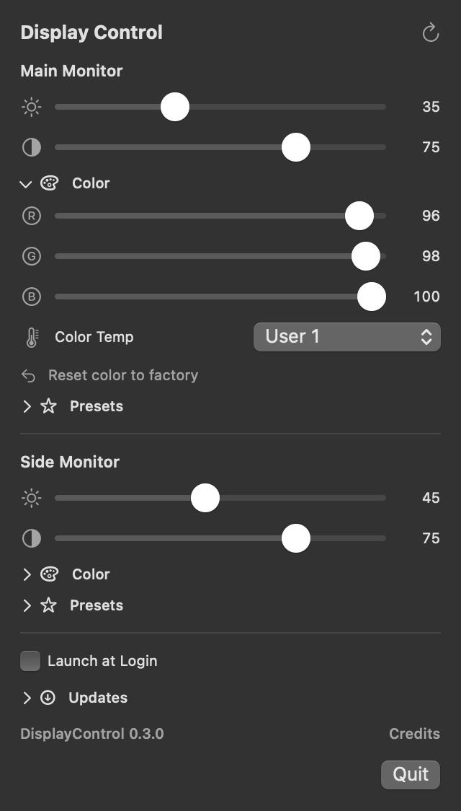

# DisplayControl

Control your external monitors from your Mac’s menu bar. Adjust brightness,
contrast, and color, save named presets, and restore your settings when displays
reconnect.

**Apple Silicon · macOS 13 Ventura or later · DDC/CI monitors**

**[Download the latest release](https://github.com/johndavidwright/display-control/releases/latest)**
· [Release notes](https://github.com/johndavidwright/display-control/releases)
· [Report an issue](https://github.com/johndavidwright/display-control/issues)

  
   
  App interface with example monitors. Available controls depend on your display.

## What you can do

- **Adjust each monitor:** brightness, contrast, and volume where supported.
- **Fine-tune color:** red, green, and blue gains, color temperature presets,
  and the monitor’s factory color reset.
- **Save named presets:** keep different settings for each display and apply
  them from the menu.
- **Keep your settings:** confirmed adjustments are saved and restored after
  launch, refresh, wake, and reconnection.
- **Stay up to date:** check for updates from the app, with optional automatic
  checks and installation.
- **Launch at login:** keep controls a click away, without a Dock icon.

## Install

1. Download the **DisplayControl-…-macOS-arm64.zip** app from
   [the latest release](https://github.com/johndavidwright/display-control/releases/latest).
2. Unzip it and move **DisplayControl.app** to **Applications**. Quit an older
   copy before replacing it.
3. Open DisplayControl and click the **sun icon** in the menu bar.

**First launch:** the app is ad-hoc signed and is **not notarized by Apple**.
macOS may block it because it cannot verify the developer. If you trust the
download, try opening it once, then use **System Settings → Privacy & Security →
Open Anyway**, if offered. See [Apple’s guidance](https://support.apple.com/en-us/102445).

### Updates

Open **Updates → Check for Updates…** in the app. You can also enable automatic
checks and choose whether updates download and install automatically.
Downloads are verified using signed updates through [Sparkle](https://sparkle-project.org/).
These signatures are separate from Apple notarization.

If you are upgrading from **0.2.5 or earlier**, install the latest version
manually once to get the updater.

## Compatibility

DisplayControl requires an **Apple Silicon Mac**, **macOS 13 or later**, and an
external monitor that supports **DDC/CI**—the connection used to change the
monitor’s own settings. Enable DDC/CI in the monitor’s menu if it has that option.

The controls shown depend on what your monitor reports. Support can vary with
the monitor, cable, dock, or adapter. Intel Macs, built-in displays, and input
source switching are not supported.

## Troubleshooting

- **A monitor or control is missing:** check that DDC/CI is enabled, try a direct
  connection, and click the refresh icon in DisplayControl.
- **An adjustment fails:** quit other monitor-control apps, then try again.
  DisplayControl checks whether the monitor accepted a change and reports failures.
- **RGB controls do not respond:** some monitors require **User 1** or **User 2**
  under **Color Temp** before they allow custom gains.
- **A monitor stops responding:** disconnect and reconnect its cable or power.
  Some USB-C displays need the cable unplugged to reset their control connection.

Still having trouble? [Open an issue](https://github.com/johndavidwright/display-control/issues)
with your Mac model, macOS and app versions, monitor model, connection setup,
and the error you see. For deeper investigation, see the
[DDC reference and diagnostics](docs/DDC.md).

## Build and contribute

Built with SwiftUI and Swift Package Manager. See the
[development guide](docs/DEVELOPMENT.md) for building, architecture, and testing,
or the [release guide](docs/RELEASING.md) for publishing updates.
Bug reports and pull requests are welcome.

## License and credits

DisplayControl is available under the [MIT License](LICENSE).
Copyright © 2026 John David Wright.

Monitor communication includes code adapted from
[MonitorControl](https://github.com/MonitorControl/MonitorControl); its
[MIT notice](THIRD_PARTY/MonitorControl-LICENSE.txt) is preserved.
In-app updates use [Sparkle](https://sparkle-project.org/).
The app bundle includes the MonitorControl and Sparkle license notices.
